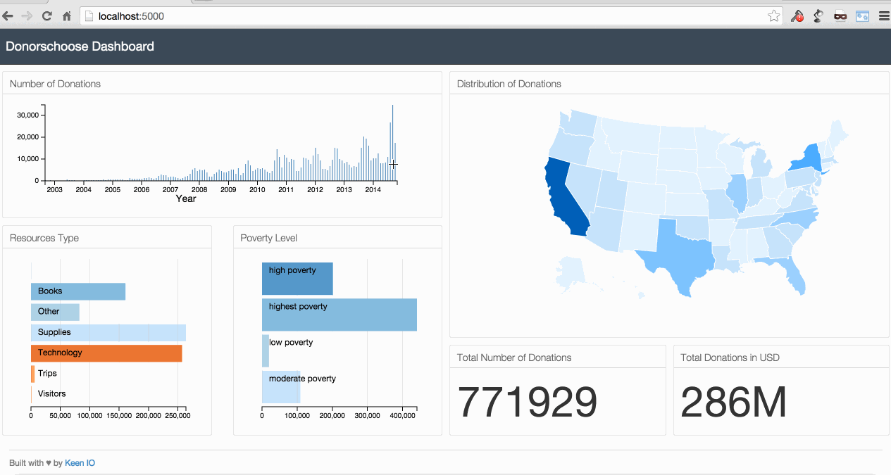

# DonorsChoose_Visualization
This project is forked from an existing repo and rebuilt with updated packages as follows:
* python 3.7.4
* mongodb 4.4
* D3.js and DC.js

# DonorsChoose_Visualization
* Source Code for my blog post: [Interactive Data Visualization with D3.js, DC.js, Python, and MongoDB](http://adilmoujahid.com/posts/2015/01/interactive-data-visualization-d3-dc-python-mongodb/)

#Visit my Blog : http://adilmoujahid.com

## Getting started

The dependencies for the project can be installed using

    $ pip install -r requirements.txt

You can use ``Vagrant`` to start a machine with a MongoDB instance running

    $ vagrant up

To initialize the database you need to download the data

    $ wget https://s3.amazonaws.com/open_data/csv/opendata_projects.zip && unzip opendata_projects.zip

and import it

    $ mongoimport -d donorschoose -c projects --type csv --file /vagrant/opendata_projects.csv -headerline
